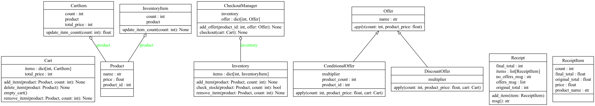

## Table of contents

1. [About](#about)
2. [Design](#design)
3. [Setup](#setup)
4. [App Test](#app-test)

### About

This is a Scala based Shopping cart REPL (read–eval–print loop) application to achieve the below results.

Write a program driven by unit tests that can price a basket of goods taking into account some special offers.
The goods that can be purchased, together with their normal prices are
```
Soup – 65p per tin
Bread – 80p per loaf
Milk – £1.30 per bottle
Apples – £1.00 per bag
```
Current special offers

`Apples have a 10% discount off their normal price this week`

`Buy 2 tins of soup and get a loaf of bread for half price`

The program should accept a list of items in the basket and output the subtotal, the special offer discounts and the final price.

Input should be via the command line in the form PriceBasket item1 item2 item3 ...


For example

PriceBasket Apples Milk Bread
Output should be to the console, for example:
```
Subtotal: £3.10
Apples 10% off: 10p
Total price: £3.00
```
If no special offers are applicable the code should output:
```
Subtotal: £1.30
(No offers available)
Total price: £1.30
```


### Design

Created the classes for the main actors in the shopping cart. High level design.




### Setup

**macOS**

Run the following command in your terminal, following the on-screen instructions:

    brew install coursier/formulas/coursier && cs setup

Alternatively for Apple Silicon, or if you don't use Homebrew:

On the Apple Silicon (M1, M2, …) architecture:

    curl -fL https://github.com/VirtusLab/coursier-m1/releases/latest/download/cs-aarch64-apple-darwin.gz | gzip -d > cs && chmod +x cs && (xattr -d com.apple.quarantine cs || true) && ./cs setup

Otherwise, on the x86-64 architecture:

    curl -fL https://github.com/coursier/coursier/releases/latest/download/cs-x86_64-apple-darwin.gz | gzip -d > cs && chmod +x cs && (xattr -d com.apple.quarantine cs || true) && ./cs setup

**Linux**

Run the following command in your terminal, following the on-screen instructions.

On the x86-64 architecture:

    curl -fL https://github.com/coursier/coursier/releases/latest/download/cs-x86_64-pc-linux.gz | gzip -d > cs && chmod +x cs && ./cs setup

Otherwise, on the ARM64 architecture:

    curl -fL https://github.com/VirtusLab/coursier-m1/releases/latest/download/cs-aarch64-pc-linux.gz | gzip -d > cs && chmod +x cs && ./cs setup

**Windows**

Download and execute [the Scala installer for Windows](https://github.com/coursier/coursier/releases/latest/download/cs-x86_64-pc-win32.zip) based on Coursier, and follow the on-screen instructions.

JavaScript is disabled, click the tab relevant for your OS.

**Other**

Follow the documentation from Coursier on [how to install and run `cs setup`](https://get-coursier.io/docs/cli-installation).


### App Test

1.  `cd` into `shopping-cart`.
2.  Run `sbt`. This opens up the sbt console.
3.  Type `~run`. The `~` is optional and causes sbt to re-run on every file save, allowing for a fast edit/run/debug cycle. sbt will also generate a `target` directory which you can ignore.

When you’re finished experimenting with this project, press `[Enter]` to interrupt the `run` command. Then type `exit` or press `[Ctrl+D]` to exit sbt and return to your command line prompt.


## References 

1. [Scala Getting Started](https://docs.scala-lang.org/getting-started/index.html)